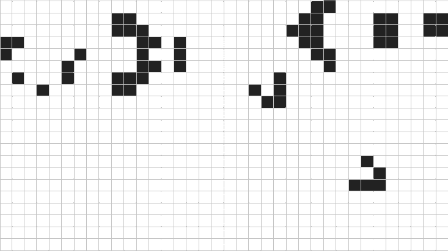

## Game Of Life

# get started:

Run the following commands in linux env:

`$ make`
`$ ./gol 10 100`

You can tweak the parameters given like so:
`$ ./gol [cell size] [cell count]`
(keep in mind there is a cap of 1000px that you can modify
by changing the `WIN_CAP` definition in the `gol.h` header).
